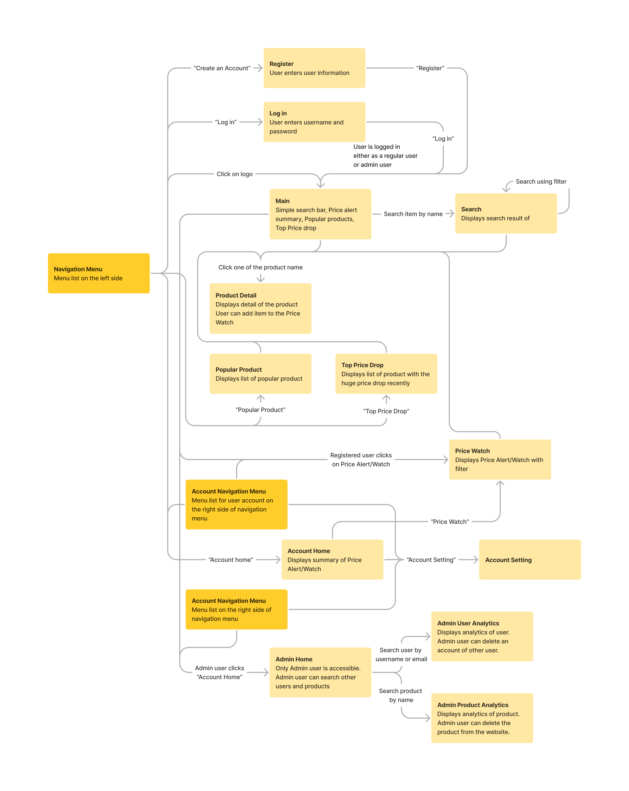

# COSC 360 Project Camelcamelcamel Clone

## Milestones 1: Proposal

### Team members

Adams Chen 50905454  
Taii Hirano 44551257  
Yuki Isomura 11888757  

### Project Description and Details: Camelcamelcamel Clone

We are developing a website, Camelcamelcamel Clone, designed to offer users a comprehensive platform for tracking and monitoring product prices on Amazon.ca. The website will cater to both registered and unregistered users, providing valuable insights into the pricing trends of various items available on the Amazon platform.

### List of Requirements

#### Unregistered User

- Create an account with their name, email and image
- Edit their account settings/profile
- Search for items by keyword, categories or manufacturer
- Order search results by price (ascending/descending), relevance and average customer rating on Amazon
- Filter search results by attributes
- Display product price, but not product details
- View general price trends of products in real-time
- Aggregate popular products
- Aggregate products with top-price drops

#### Registered User

- Log in to the platform with registered credentials
- View/edit their profile
- Display product details (with comments added)
- Price drop or product availability alert via email
- Add review to the product

#### Administrator

- Search for a user by name or email
- Enable/disable the user account

## Milestones 2: Client-side experience

### Layout Document

- Screenshot of Layout Document from Figma

### Organization of Pages

### Logic Process

- Some user stories

### Design and Style Description

On our website, we’ve structured the layout with a header footer, and navigation bar for consistency across all pages. To optimize user experience, we’ve decided to place the navigation links at the top, ensuring easy access for seamless navigation between pages.

On the main page, users will encounter tailored components based on their registration status. For Non-Registered Users, a curated list of popular products will be showcased, featuring product images and highlighting top price drop products. This section aims to engage non-registered users with compelling offers and discounts, encouraging them to explore further and potentially sign up.

For Registered Users, in addition to a list of popular products, a prominent feature is the “Price Alert” button placed at the top of the page. This button serves as a direct link to a list of products within the user’s watch list where prices have dropped. This feature is designed to empower registered users by keeping them updated on price changes for products they are interested in.

Additionally, when users conduct a product search, the results will display a list of products accompanied by clear and visible product images on the left. This presentation enhances the visibility and attractiveness of the listed products, aiding users in making informed decisions.

By implementing these features, we aim to provide a user-friendly experience for both registered and non-registered users, catering to their specific needs and preferences.
